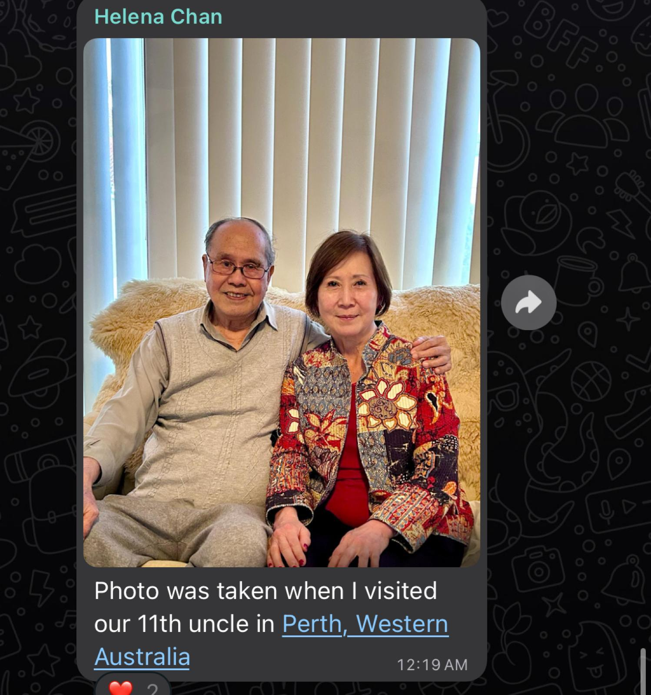
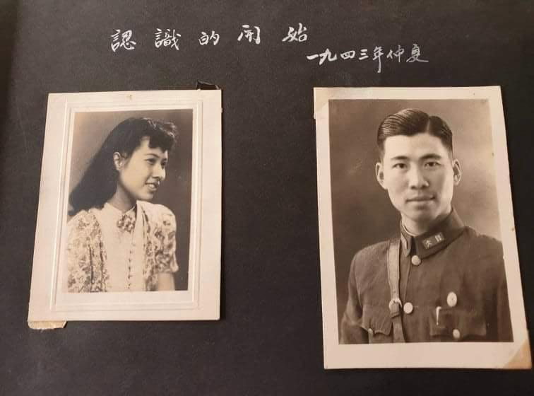
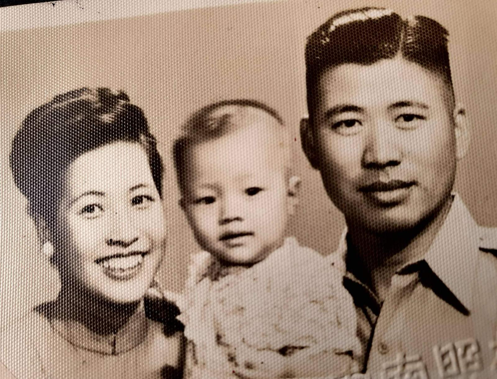
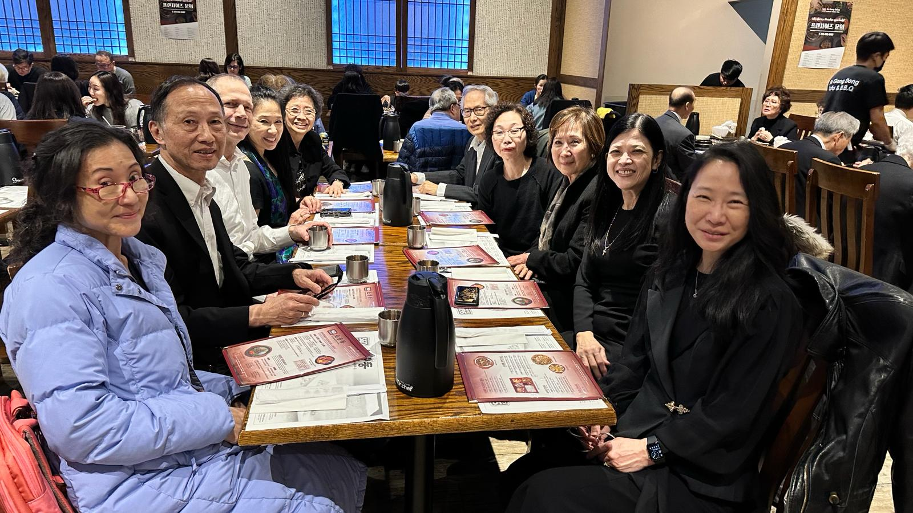
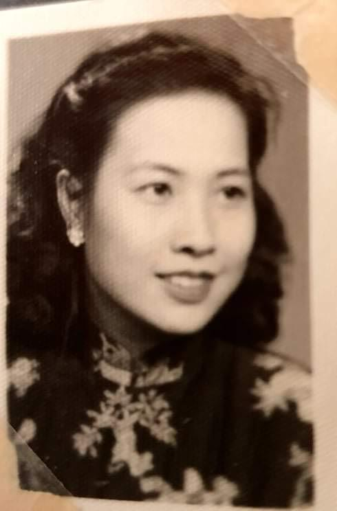
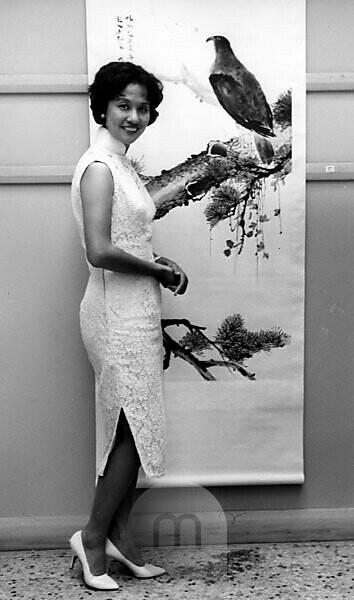
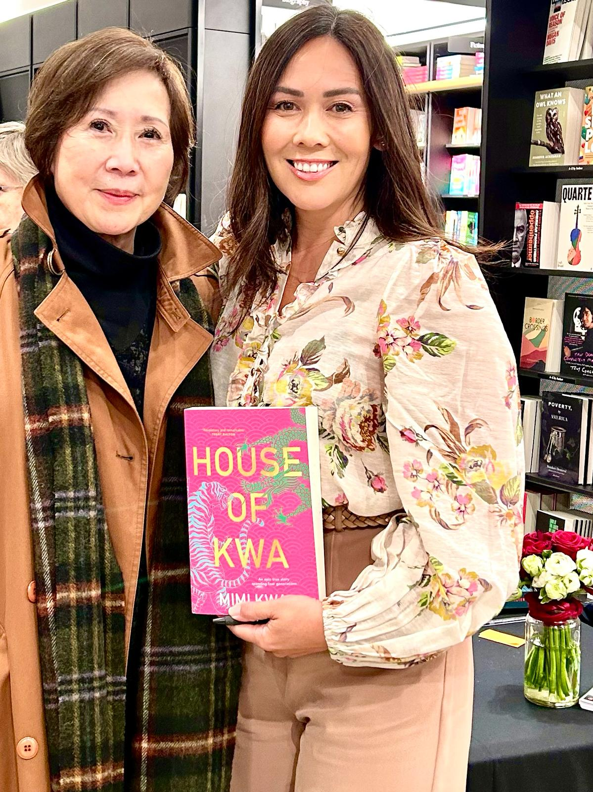

# Ying Kam
32 children (24 of them numbered - 12 sons and 12 daughters)

11th-uncle-and-helena

Grace remembers 11th uncle as having been a heart surgeon.

Helena is 3rd child of 2nd Aunty, who married No.1 Lee uncle; they had Esther, George, Helena, and Alfred.

11th-auntie-mary-and-tony

11th-auntie-mary-tony-and-child

2024-02-25-lees-fans-walquists-helena-mandy

4th-auntie-theresa

Hong Kong Artist Theresa Wai Ching Kwa, Who Stands Beside One Of Her Scroll Paintings At The Art Gallery Of The Commonwealth Institute,London.

Miss Kwa, who Is An Air Hostess As Well As An Artist, Flew Into London Recently To Be Present At This Official Opening Of Her "One Girl" Exhibition Of Over 75 Scroll Paintings, By Sir Alexander Grantham, Former Governor Of Hong Kong. Miss Kwa Left A Secretarial Post To Become An Air Stewardess, Looked Around For A Hobby During Her Rest Days. She Picked Traditional Chinese Painting And Now Her Studies Have Prospered.

3 July 1959

Image 12283889, https://www.mauritius-images.com/

helena-and-mimi
